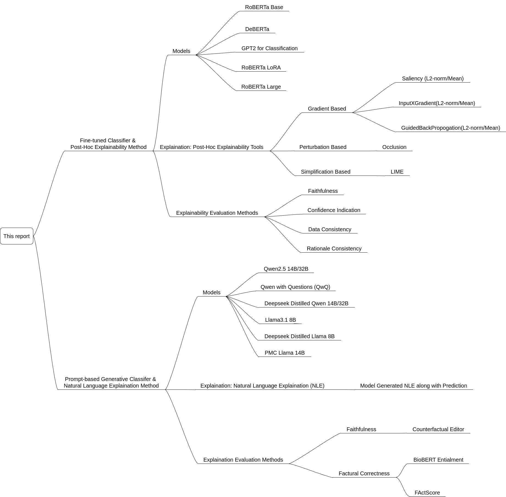
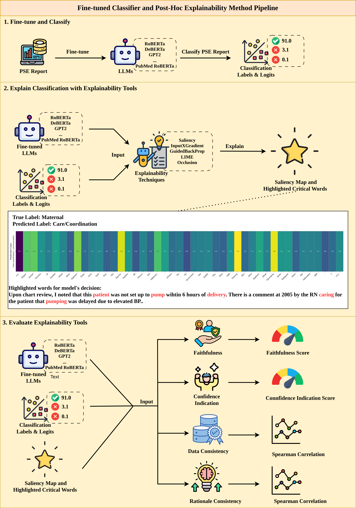
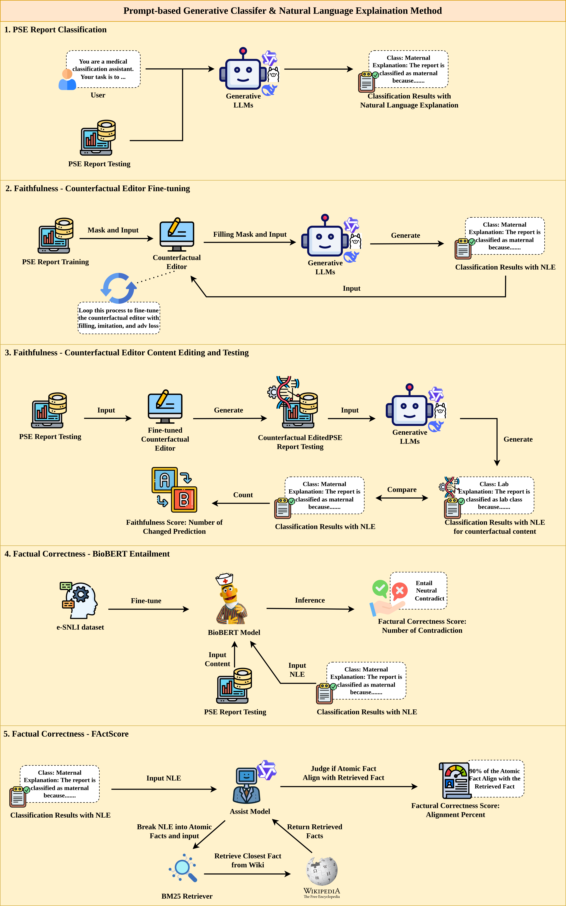

# Evaluating Explainability with LLM for Patient Safety Event Report Classification 
This is the research for Zhifei Dou under the supervision of Eldan Cohen. This project aims to evaluate the **post-hoc explainability techniques (XAI) for fine-tuned models with classification heads and natural language explanations for generative models** with collected Patient Safety Event (PSE) report to assist medical organization staffs.

## Project Details
The details of this project can be find [here](/Assets/Project_report.pdf)

## Project Structure
Following is the structure of this project, mainly consist of two methods: Fine-tune and Post-Hoc, Prompt-based generation and NLE

The process map for Fine-tune and Post-Hoc Method is:

The process map for the Generative and NLE Method is:

